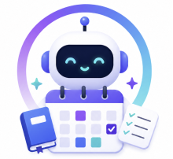

# 🎓 AI Study Buddy

A unified AI assistant that helps students analyze their syllabi, build personalized study schedules, and generate practice quizzes — all through a simple conversational interface powered by Google Gemini.



---

## 🚀 Problem Statement

Students often struggle to manually extract critical deadlines and topics from dense syllabi, and find it even harder to stick to rigid schedules. The **AI Study Buddy** solves this by letting students upload their syllabus and chat directly with an AI. The AI can instantly analyze dates, generate adaptive study plans, and test knowledge with custom quiz questions — and even schedule sessions directly into **Google Calendar**.

---

## 🏗️ Architecture

```
[ User ] ──(Uploads PDF/TXT & Prompts)──▶ [ Streamlit Chat Interface (ui/app.py) ]
                                                          │
                                                          ▼
                                           [ StudyBuddyAgent (Gemini 2.5 Flash) ]
                                                    (agent/agents.py)
                                                          │
                                          ┌───────────────┴───────────────┐
                                          ▼                               ▼
                               [ Gemini API via               [ Google Calendar API ]
                                  google_adk.py ]          (agent/calendar_integration.py)
```

| Component | File | Description |
|---|---|---|
| **UI / Frontend** | `ui/app.py` | Streamlit chat interface; handles file uploads, voice input, TTS, and OAuth callback |
| **AI Agent** | `agent/agents.py` | Configures the `StudyBuddyAgent` with tools and Gemini model |
| **Gemini Wrapper** | `google_adk.py` | Lightweight wrapper around `google-genai` for chat + function calling |
| **Calendar Tools** | `agent/calendar_integration.py` | CRUD functions for Google Calendar via OAuth |
| **Database** | `Firebase Firestore` | Cloud database for persistent chat history |
| **MCP Server** | `mcp_server/server.py` | Standalone Model Context Protocol server (Phase 2 / optional) |

---

## 🛠️ Setup Instructions

### Prerequisites

- **Python 3.10 or higher** (required for `list[Type]` type hints used in the code)
- A **Google account** (for Gemini API key and optional Google Calendar integration)
- **pip** (comes bundled with Python)

---

### 1. Clone the Repository

```bash
git clone https://github.com/your-username/your-repo-name.git
cd your-repo-name
```

---

### 2. Create & Activate a Virtual Environment

It is strongly recommended to use a virtual environment to avoid dependency conflicts.

**Windows (PowerShell):**
```powershell
python -m venv .venv
.venv\Scripts\Activate.ps1
```

**macOS / Linux:**
```bash
python3 -m venv .venv
source .venv/bin/activate
```

---

### 3. Install Dependencies

```bash
pip install -r requirements.txt
```

The `requirements.txt` installs the following packages:

| Package | Purpose |
|---|---|
| `streamlit` | Web UI framework |
| `python-dotenv` | Load `.env` files into environment variables |
| `PyPDF2` | Extract text from uploaded PDF syllabi |
| `google-genai` | Google Gemini API client (chat + function calling) |
| `google-auth-oauthlib` | OAuth 2.0 flow for Google Calendar authentication |
| `google-api-python-client` | Google Calendar REST API calls |
| `mcp` | Model Context Protocol server support |
| `gtts` | Google Text-to-Speech for voice responses |
| `pydantic` | Data validation for batch calendar event creation |
| `firebase-admin` | Connects to Firebase Firestore for cloud chat storage |

> **⚠️ Note:** Do NOT install `google-generativeai` — this project uses `google-genai` (the newer unified client). Installing the wrong package will cause an `ImportError`.

---

### 4. Configure Environment Variables

Copy the example env file and fill in your own credentials:

```bash
# Windows
copy .env.example .env

# macOS / Linux
cp .env.example .env
```

Now open `.env` and fill in the values:

```env
# Gemini API Key — required for AI responses
GEMINI_API_KEY=your_gemini_api_key_here

# Google Calendar OAuth 2.0 — required only for calendar features
GOOGLE_CLIENT_ID=your_google_client_id_here
GOOGLE_CLIENT_SECRET=your_google_client_secret_here
```

#### 4a. Get a Gemini API Key

1. Go to [Google AI Studio](https://aistudio.google.com/app/apikey)
2. Click **"Create API key"**
3. Copy the key into `GEMINI_API_KEY` in your `.env`

#### 4b. Get Google Calendar Credentials *(optional — for calendar features)*

1. Go to the [Google Cloud Console](https://console.cloud.google.com/)
2. Create a new project (or select an existing one)
3. Search for **"Google Calendar API"** and enable it
4. Go to **OAuth consent screen** → select **External**
   - Fill in App name and support email
   - Add the scope: `https://www.googleapis.com/auth/calendar`
   - Add your own email as a **Test User**
5. Go to **Credentials → Create Credentials → OAuth client ID**
   - Application type: **Web application**
   - Add Authorized Redirect URI: `http://localhost:8501/`
6. Copy the **Client ID** and **Client Secret** into your `.env`

#### 4c. Setup Firebase Firestore (Required for Chat History)

1. Go to the [Firebase Console](https://console.firebase.google.com/) and click **Add project**.
2. Name your project (e.g., "StudyPlanner-AI") and click Continue.
3. In the left sidebar, go to **Build → Firestore Database**.
4. Click **Create database**. Select **Start in Test Mode** and choose a location.
5. Click the **Gear Icon ⚙️ (Project settings)** in the top left corner.
6. Go to the **Service accounts** tab and click **Generate new private key**.
7. A `.json` file will download to your computer.
8. **CRITICAL:** Move this file into the root of this cloned repository (`ai-agent-hackathon/`) and rename it exactly to `firebase-credentials.json`.

---

### 5. Run the Application

```bash
streamlit run ui/app.py
```

The app will open automatically at [http://localhost:8501](http://localhost:8501).

---

### 6. *(Optional)* Run the MCP Server

The MCP server is a standalone component for external tool integrations:

```bash
python mcp_server/server.py
```

---

## 📁 Project Structure

```
ai-agent-hackathon/
│
├── ui/
│   └── app.py                    # Streamlit frontend + OAuth callback handler
│
├── agent/
│   ├── agents.py                 # StudyBuddyAgent definition (Gemini + tools)
│   └── calendar_integration.py   # Google Calendar CRUD tools + OAuth credential loader
│
├── mcp_server/
│   └── server.py                 # FastMCP server (optional / Phase 2)
│
├── google_adk.py                 # Gemini API wrapper (Agent class)
├── requirements.txt              # All Python dependencies
├── .env.example                  # Template for environment variables (safe to commit)
├── .env                          # Your local secrets — NEVER commit this!
├── .gitignore                    # Excludes .env, token.json, __pycache__, etc.
├── LOGO.png                      # App logo
└── README.md                     # This file
```

---

## 🔒 Security Notes

- **`.env` is git-ignored** — your API keys are never pushed to GitHub.
- **`token.json`** (Google Calendar OAuth token) is also git-ignored.
- **`agent_error.log`** is git-ignored.
- `.env.example` contains only placeholder values — it is safe to commit.
- Never hardcode API keys or secrets in source files.

---

## ✨ Features

- 📄 **Syllabus Analysis** — Upload PDF or TXT syllabi; the AI extracts topics, deadlines, and exam dates
- 📅 **Study Plan Generation** — AI checks your Google Calendar for busy slots and builds a conflict-free plan
- 🗓️ **Calendar Integration** — Automatically schedules, updates, or deletes study sessions in Google Calendar
- ❓ **Practice Quizzes** — Generates custom quiz questions based on your syllabus topics
- 🎙️ **Integrated Voice & UI** — Chat or speak using our seamless ChatGPT-like interface. Includes instant Copy 📋 and Listen 🔊 action buttons!
- ☁️ **Cloud Chat History** — All conversations are securely backed up to Firebase Firestore in real-time.
